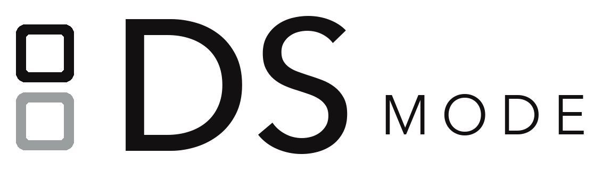
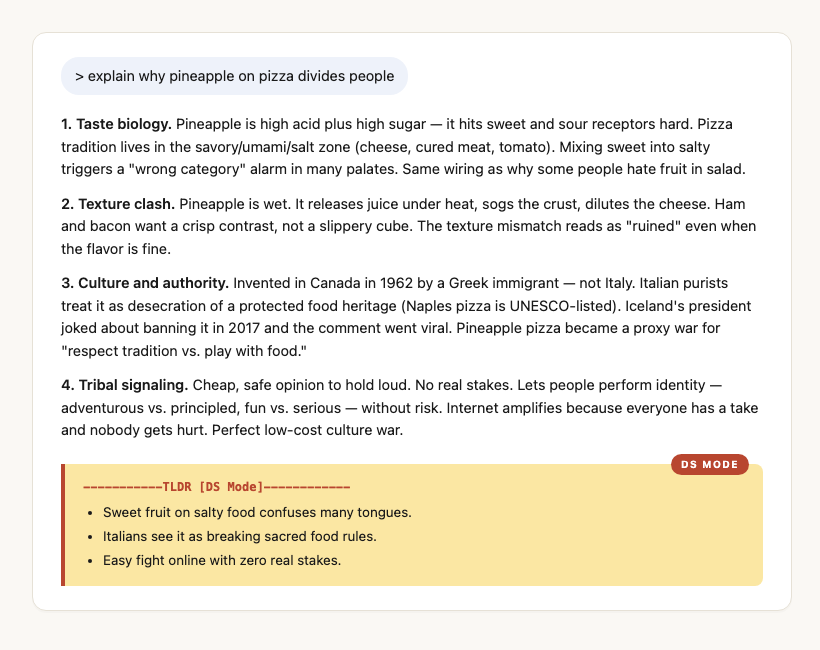

<p align="center">
  <picture>
    <source media="(prefers-color-scheme: dark)" srcset="docs/assets/ds-mode-logo-dark.png">
    
  </picture>
</p>

<h2 align="center">Answers in plain English. With pretty pictures.</h2>

<p align="center">
  <strong>DS Mode</strong> <code>/dɛs məʊd/</code> <em>n.</em> &nbsp;from German <em>Dumm Sprecht</em>: to speak simply.
</p>

<p align="center">
  Big-brain reply on top. Plain-English nudge at the bottom.<br>
  Pictures when things get long.
</p>

<p align="center">
  For
   Claude Code ·
   Cursor ·
   Codex ·
   Copilot
</p>

<p align="center">
  <a href="https://nathan-hekman.github.io/ds-mode/"><strong>Landing page →</strong></a> ·
  <a href="#install">Install</a> ·
  <a href="#what-you-get">What You Get</a>
</p>

<p align="center">
  
</p>

<p align="center"><em>The top is the normal AI answer. The yellow block at the bottom is what DS Mode adds.</em></p>

---

DS Mode is a system-prompt overlay for AI coding agents. It does two things:

1. **Adds a plain-English TL;DR to the bottom** of every long or technical reply.
   Three bullets, twelve words each, no jargon.
2. **Auto-generates a one-page HTML visual** in your browser when the answer
   runs long or covers many parts.

Built for product managers, founders, and **anyone who'd rather skim a TL;DR
than parse a wall of jargon**.

> *For people who skim. Built by one of them.*

## Install

**One line. Plugin install, hooks wired, mode set to `full`.**

```bash
bash <(curl -fsSL https://raw.githubusercontent.com/nathan-hekman/ds-mode/main/install-claude-code.sh)
```

That's it. Restart Claude Code — DS Mode is on by default in every new session. Toggle per-session with `/dsm`.

See [INSTALL.md](./INSTALL.md) for advanced flags, local-clone install, and uninstall.

| Flag | What |
|---|---|
| `--minimal` | Plugin install only — skip statusline + shell rc edits. |
| `--default-mode <mode>` | Set the install-time default to `lite`, `full`, or `visual`. Defaults to `full`. |
| `--force` | Overwrite a prior install. |
| `--dry-run` | Print planned actions; write nothing. |

## What You Get

| Feature | Claude Code | Cursor / Windsurf | Copilot | Codex |
|---|:-:|:-:|:-:|:-:|
| Plain-English TLDR at bottom of replies | Y | Y* | Y* | Y* |
| HTML one-pager when reply is long/dense | Y | — | — | — |
| Mode switching (`lite` / `full` / `visual` / `off`) | Y | — | — | — |
| Statusline `DS:<mode>` chip | Y | — | — | — |
| `/ds-mode-show` (session recap HTML) | Y | — | — | — |
| `/ds-mode-user-flows` (project user flows HTML+JSON) | Y | — | — | — |
| Auto-activate every session | Y | with adapter | with adapter | with adapter |

\* Cursor/Copilot/Codex get the TLDR rule via the adapter rule files in `adapters/`. HTML one-pager + mode toggle + skills are Claude Code only — they depend on hooks + slash commands.

## Usage

Trigger with:
- `/dsm` or `/ds-mode` — activate at default mode
- `/dsm lite|full|visual` — pick a mode
- `/dsm off` — disable for this session
- Natural language: "ds mode on", "stop ds mode", "talk like ds mode"

Skills:
- `/ds-mode-show` — one-page HTML recap of the current conversation
- `/ds-mode-user-flows` — one-page HTML + JSON map of the project's main user flows

## Modes

| Mode | Behavior |
|---|---|
| `lite` | TLDR block at bottom of non-trivial replies. No HTML. Use when you want plain-English recaps without browser pop-ups. |
| `full` | **Default.** TLDR + HTML one-pager when the prime directive fires (length, density, decision, blocker triggers). |
| `visual` | TLDR + HTML one-pager on every non-trivial reply (>3 sentences). Use when you want consistent visual deliverables. |
| `off` | Disabled for this session. Flag removed; hooks emit nothing. |

## How It Works

DS Mode is a Claude Code plugin (`.claude-plugin/plugin.json`). It registers two hooks:

1. **SessionStart** (`hooks/ds-mode-activate.js`) — reads the current mode from `$CLAUDE_CONFIG_DIR/.ds-mode-active`, filters `skills/ds-mode/SKILL.md` to the active mode, and injects the ruleset as session context.
2. **UserPromptSubmit** (`hooks/ds-mode-tracker.js`) — parses `/dsm` commands, updates the flag, and re-anchors a short prime-directive reminder every turn so the rules survive context compression.

State is persistent across sessions in `$CLAUDE_CONFIG_DIR/.ds-mode-active`. HTML outputs are ephemeral in `$TMPDIR`.

## Other Tools

The `adapters/` directory holds rule-file generators for Cursor, Copilot, and Codex. These get you the TLDR rule but not the HTML one-pager — they don't have a hook system. See `adapters/<tool>/README.md`.

## Why DS Mode

Default AI coding-agent responses are great for engineers. They're rough on
everyone else. Dense walls of jargon. Equations mid-sentence. Ten-bullet recaps
that are themselves a wall.

DS Mode keeps the depth where it belongs (top of the answer) and adds a short,
plain-English recap at the bottom — plus a one-page visual when the answer earns
one. You can read the technical version, the recap, the picture, or all three.

## License

MIT — see [LICENSE](./LICENSE).

Source: [github.com/nathan-hekman/ds-mode](https://github.com/nathan-hekman/ds-mode)

## Contributing

PRs welcome. Especially:

- Adapters for other tools (Continue, aider, JetBrains AI Assistant, etc.)
- Better cartoon SVGs for the visual one-pager
- Translations of the plain-English style for other languages
- Cross-platform fixes for the `open` behavior (Linux, Windows)

Open an issue at [nathan-hekman/ds-mode/issues](https://github.com/nathan-hekman/ds-mode/issues)
to request a port or report a bug.
