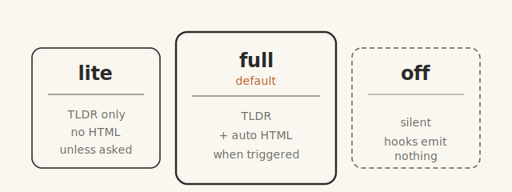

<p align="center">
  <picture>
    <source media="(prefers-color-scheme: dark)" srcset="docs/assets/ds-mode-logo-dark.png">
    
  </picture>
</p>

<h2 align="center">Answers in plain English. With pretty pictures.</h2>

<p align="center">
  <strong>DS Mode</strong> <code>/dɛs məʊd/</code> <em>n.</em> &nbsp;from German <em>Dumm Sprecht</em>: to speak simply.
</p>

<p align="center">
  Big-brain reply on top. Plain-English nudge at the bottom.<br>
  A visual one-pager when things get long.
</p>

<p align="center">
  For
   Claude Code ·
   Cursor ·
   Codex ·
   Copilot
</p>

<p align="center">
  <a href="https://nathan-hekman.github.io/ds-mode/"><strong>Landing page →</strong></a> ·
  <a href="#install">Install</a> ·
  <a href="#what-you-get">What You Get</a>
</p>

<p align="center">
  
</p>

<p align="center"><em>The top is the normal AI answer. The yellow block at the bottom is what DS Mode adds.</em></p>

---

DS Mode is a system-prompt overlay for AI coding agents. Install it, pick `lite` or `full`, and it just works. It does two things:

1. **Adds a plain-English TL;DR to the bottom** of every long or technical reply. Three bullets, twelve words each, no jargon.
2. **Auto-generates a one-page visual HTML** in your browser when the reply is a decent length (full mode only — or any time you explicitly invoke `/ds-mode <question>`). Illustration-first — hero diagram + captioned tiles, not boxes of text.

Built for product managers, founders, and **anyone who'd rather skim a picture than parse a wall of jargon**.

> *For people who skim. Built by one of them.*

## Modes

<p align="center">
  
</p>

| Mode | Behavior |
|------|----------|
| **lite** | TLDR block only. No HTML one-pager unless you explicitly invoke `/ds-mode <prompt>`. Best for terminal-heavy workflows where browser pop-ups are noise. |
| **full** | TLDR + auto HTML one-pager when the reply is a decent length (≥ ~300 words, multi-part concept, 2+ headings, code + narrative, A/B decision). **Default.** |
| **off** | Disabled this session. Hooks emit nothing. |

The active mode persists in `$CLAUDE_CONFIG_DIR/.ds-mode-active`. Switch with `/ds-mode lite` or `/ds-mode full`.

## Theme

The visual one-pager adapts to your OS dark-mode preference by default. You can pin it explicitly:

```
/ds-mode dark      # force dark palette on every one-pager
/ds-mode light     # force light palette
/ds-mode auto      # follow OS preference (default)
```

Theme persists in `$CLAUDE_CONFIG_DIR/.ds-mode-theme`.

## Mobile mode (private GitHub publish)

Off by default. When enabled, every visual one-pager auto-publishes to a **private GitHub repo owned by you**, and the reply includes a tappable URL. On your phone, log into GitHub once (Safari or the GitHub mobile app) and the image renders inline — no one else can see it.

Setup (one-time):

```
/ds-mode mobile setup
```

The wizard verifies your `gh` CLI auth, creates `<your-github-user>/ds-mode-mobile` as a **private** repo, clones it locally, and writes the config. After that, every stamped one-pager publishes in the background (~1–3s). The URL pattern is `github.com/<you>/ds-mode-mobile/blob/main/<file>.png` — requires your GitHub session to view, so it's effectively owner-only.

Toggle:

```
/ds-mode mobile on        # re-enable after off (no re-setup)
/ds-mode mobile off       # pause publishing (config preserved)
/ds-mode mobile status    # show current state
```

Requires `gh` CLI installed (`brew install gh`) and `gh auth login` completed. Free GitHub accounts can create private repos. See [INSTALL.md](./INSTALL.md#mobile-mode-prerequisites) for the full prereq list.

## Update detection

DS Mode pings GitHub once a day in the background to check for newer plugin releases. When one's available you see two ambient signals — never in the TLDR:

- The statusline chip becomes `DS:full ↑` (the up-arrow means "update available").
- The SessionStart context shows one line: `DS Mode vX.Y.Z is available — run claude plugin update ds-mode@ds-mode and restart Claude Code to pick it up.`

Take the update with:

```bash
claude plugin update ds-mode@ds-mode
```

Network failures are silent — a missed check just means you find out one session later.

## Install

**Pure Claude Code commands (recommended):**

```bash
claude plugin marketplace add nathan-hekman/ds-mode
claude plugin install ds-mode@ds-mode
```

DS Mode now appears in `claude plugin list` and in Claude Code's desktop plugin UI. Restart Claude Code to activate.

**One-line install with extras** (sets `DS_MODE_DEFAULT` in your shell rc, strips the legacy `outputStyle` setting):

```bash
bash <(curl -fsSL https://raw.githubusercontent.com/nathan-hekman/ds-mode/main/install-claude-code.sh)
```

DS Mode starts in `full` mode by default in every new session. To start in lite or off:

```bash
./install.sh --default-mode lite     # start in lite mode
./install.sh --default-off           # install but stay disabled until /ds-mode on
```

See [INSTALL.md](./INSTALL.md) for advanced flags, local-clone install, and uninstall.

## What You Get

| Feature | Claude Code | Cursor / Windsurf | Copilot | Codex |
|---|:-:|:-:|:-:|:-:|
| Plain-English TLDR at bottom of replies | Y | Y* | Y* | Y* |
| Visual HTML one-pager when reply is decent length | Y | Y* | markdown fallback | Y* |
| Four ready-made templates (explainer, comparison, decision, status) + reusable SVG stencils | Y | — | — | — |
| `/ds-mode <your question>` — forced visual one-pager | Y | — | — | — |
| Mode switching (`lite` / `full` / `off`) | Y | — | — | — |
| Theme override (`/ds-mode dark` / `light` / `auto`) | Y | — | — | — |
| Mobile mode — auto-publish to your private GitHub repo, tappable from phone | Y | — | — | — |
| Update detection — passive `↑` chip when newer version exists | Y | — | — | — |
| Statusline `DS:<mode>` chip when active | Y | — | — | — |
| `/ds-mode-help` (quick-reference card) | Y | — | — | — |

\* Cursor/Codex get the full ruleset via the adapter files in `adapters/` and can run the HTML build themselves (they have shell access). Copilot Chat in standard mode renders a markdown summary instead; in Copilot Workspace agent mode it can build real HTML.

## Usage

Once installed, DS Mode is automatic on every session. Long, technical replies get a plain-English TLDR at the bottom and (in full mode) a visual HTML one-pager pops open in your browser when the answer is a decent length.

When you want explicit control:

- `/ds-mode lite` — TLDR only.
- `/ds-mode full` — TLDR + auto HTML.
- `/ds-mode off` — disable for this session.
- `/ds-mode on` — re-enable at the default mode.
- `/ds-mode dark` / `/ds-mode light` / `/ds-mode auto` — pin or auto-follow OS theme for the HTML.
- `/ds-mode mobile setup` — one-time wizard that enables private-GitHub publishing for mobile viewing (see "Mobile mode" above). Toggle with `/ds-mode mobile on` and `/ds-mode mobile off`.
- `/ds-mode Explain how the architecture works` — answer this question under DS Mode rules **and force the visual HTML one-pager** for this turn, even in lite mode. The "show me visually" lever.
- `/ds-mode-help` — show the quick-reference card.

Natural language works too: "stop ds mode", "ds mode on", etc.

## How It Works

DS Mode is a Claude Code plugin (`.claude-plugin/plugin.json`). It registers two hooks:

1. **SessionStart** (`hooks/ds-mode-activate.js`) — resolves the active mode from `$CLAUDE_CONFIG_DIR/.ds-mode-active`, filters `rules/ds-mode.md` to that mode, and injects the ruleset as session context. (The ruleset lives in `rules/` instead of `skills/` on purpose so Claude Code doesn't register it as a user-invocable skill — that would clash with the `/ds-mode` command.)
2. **UserPromptSubmit** (`hooks/ds-mode-tracker.js`) — parses `/ds-mode` commands, updates the flag, and re-anchors a short mode-specific reminder every turn so the rules survive context compression. When you invoke `/ds-mode <prompt>`, this hook flags the turn as HTML-mandatory regardless of mode.

State is a single flag file at `$CLAUDE_CONFIG_DIR/.ds-mode-active` — contents = mode name (`lite` or `full`), absent = off. HTML outputs are ephemeral in `$TMPDIR`.

## Other Tools

The `adapters/` directory holds rule-file generators for Cursor, Copilot, and Codex. Cursor and Codex get the full experience including HTML one-pagers (they have shell access). Copilot Chat in standard mode falls back to a markdown summary block. See `adapters/<tool>/README.md`.

## Why DS Mode

Default AI coding-agent responses are great for engineers. They're rough on everyone else. Dense walls of jargon. Equations mid-sentence. Ten-bullet recaps that are themselves a wall.

DS Mode keeps the depth where it belongs (top of the answer) and adds a short, plain-English recap at the bottom — plus a one-page visual when the answer earns one. You can read the technical version, the recap, the picture, or all three.

## License

MIT — see [LICENSE](./LICENSE).

Source: [github.com/nathan-hekman/ds-mode](https://github.com/nathan-hekman/ds-mode)

## Contributing

PRs welcome. Especially:

- Adapters for other tools (Continue, aider, JetBrains AI Assistant, etc.)
- Better cartoon SVGs for the visual one-pager
- Translations of the plain-English style for other languages
- Cross-platform fixes for the `open` behavior (Linux, Windows)

After cloning for development, run `scripts/install-git-hooks.sh` to install the post-commit cache-sync hook. Without it, edits to `hooks/` / `templates/` / `rules/` don't reach the plugin cache until `/plugin update ds-mode`.

Open an issue at [nathan-hekman/ds-mode/issues](https://github.com/nathan-hekman/ds-mode/issues) to request a port or report a bug.
